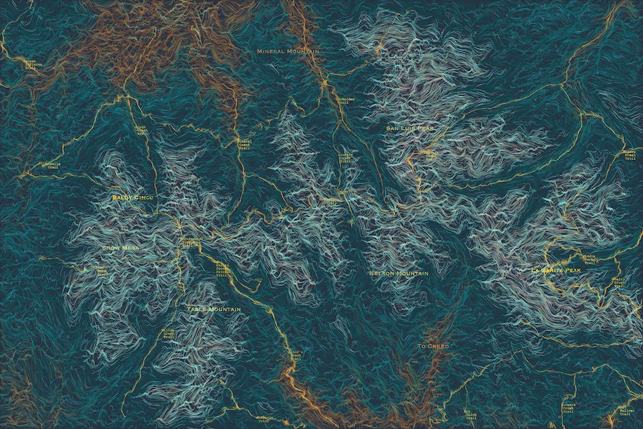

# TopoJoyEnd

TopoJoyEnd generates artistic, flowy maps from topographical data using GPU-based rendering.

## Features

- Customize color schemes to highlight elevation data
- Faster processing using GPU.js for rendering
- Export images of the generated topography

## Usage

To download terrain data, begin with the instructions at [topoJoy](www.github.com/Iancam/topoJoy).

Add the outputed `<prefix>Bounds.json` file and `<prefix>.png` to this project directory.

Update sketch.js at the top of the file: `const MAP_NAME = <prefix>`.

To change colors, edit colorUtils.js, especially the colorAt function. A description of how to do so is in the code.

The code uses [GPU.js](https://gpu.rocks/#/) to speed up processing. However, GPU memory is more limited than on the CPU. For larger images you'll need to cut the processing into slices. Edit `const N_SLICES = <num slices>` at the top of processImage.js if your image is missing pixels.

To load files, you need a server. I recommend [live-server](https://www.npmjs.com/package/live-server) for ease of use. Install it with `npm install -g live-server`. Run it by cd-ing into the root directory and calling `live-server`

Optional: To include a trail system or other shapefile like the [colorado trails](https://data.colorado.gov/Recreation/Colorado-Trail-Explorer-COTREX-/tsn8-y22x/about_data) I used, add the shapefile directory to the root directory.

Then update the sketch.js constant at the top of the file: `const TRAILS_SHP_FILE = <path to shapefile.shp>`.

You can find the code for rendering trails in layers.js, along with other optional layers included in the original.

## Background

The project was inspired by my sister's love of geology and the great enjoyment I got from working with a student on [this tutorial](https://tylerxhobbs.com/essays/2020/flow-fields) by Tyler Hobbes. In the tutorial, you create flow fields with a special kind of computer generated data called [perlin noise](https://en.wikipedia.org/wiki/Perlin_noise). I asked if perlin noise is used to model geographies, why can't geographical data be used as perlin noise?
