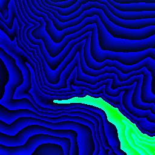
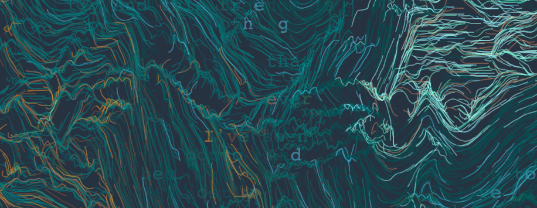

# TopoJoy


The project was inspired by my sister's love of geology and the great enjoyment I got from working with a student on [this tutorial](https://tylerxhobbs.com/essays/2020/flow-fields) by Tyler Hobbes. In the tutorial, you create flow fields with computer generated data called perlin noise. I asked if perlin noise is used to model geographies, why can't geographical data be used as perlin noise?

I used [geoJson](https://geojson.io/) to specify the area I wanted, a mountain area where my sister had backpacked as a kid. I used @mapbox/cover handled to handle the output. [mapbox terrain-rgb](https://docs.mapbox.com/vector-tiles/reference/mapbox-terrain-v2/) was used to get precise height values. The mapbox plan is free for the scale of requests I was making, but make sure that you cache responses from their server, or you may run up a bill.

Here's an example of mapbox output. In my code I converted the color of each pixel to the height at that coordinate.


I covered a large area, so I had to stitch my images together. I ended up using `vips arrayjoin "1657x3158.png 1657x3159.png..." result.png --across 9` instead of `ImageMagick append`, because the latter changed my pixel values.

The above code for downloading and stitching is now a little command line tool which is available [here](https://github.com/Iancam/topoJoy).

I also wanted to include a trail system in the map. Shapefiles seem to be lingua franca for this, and it's easy to see why: I had a trail network which was almost 126 mb as json, but as a Shapefile, it was only 33mb. [Mapshaper](https://mapshaper.org/) is a good tool to work with shapefiles, allowing you to simplify, convert and annotate them effectively.

## Processing The Topo Image

My topograph had about 3.5 million pixels, and I needed the height, slope, and aspect for each of them. Luckily, [GPU.js](https://gpu.rocks/#/) allowed me to throw these calculations onto the GPU which sped things up considerably.

```js
const gpu = new GPU();
const toHeights = gpu
  .createKernel(function hmap(data, width) {
    const { x, y } = this.thread;

    const start = y * (width * 4) + x * 4;
    const [R, G, B, A] = [
      data[start],
      data[start + 1],
      data[start + 2],
      data[start + 3],
    ];
    return -10000 + (R * 256 * 256 + G * 256 + B) * 0.1;
  })
  .setPipeline(true)
  .setDynamicOutput(true);
```

With very large files, my GPU memory flopped. To fix it, I had to slice the image data.

```js
const nSlices = 4;
const step = height / nSlices;
const slices = times(nSlices, (i) =>
  data.slice(i * step * width * 4, (i + 1) * step * width * nSlices)
).map((data) => {
  const htex = toHeights.setOutput([width, step])(data, width);
  const pixels = slope.setOutput([width, step])(htex, pixDist);
  const extremay = extrema_y.setOutput([step])(htex, step);
  const [min, max] = extremay.reduce(([min, max], [mi, ma]) => {
    return [Math.min(mi, min), Math.max(ma, max)];
  });
  return {
    min,
    max,
    magnitude: max - min,
    pixels,
    width,
    height,
  };
});
```

# the Final Product



The final image was created using [p5.js](http://p5js.org). Though the process image code hasn't been put in a separate library, it is somewhat reusable. The rest of the code isn't terribly reusable but I hope that it can serve as an example for other artists.
